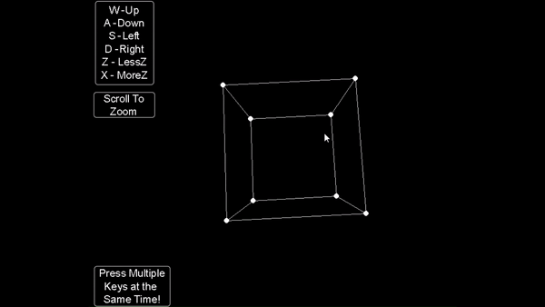

# Hexahedron-Madness

## Contributors

* [Felipe Maluli de Carvalho Dias](https://github.com/FeMCDias)
* [Lucca Hiratsuca Costa](https://github.com/LuccaHiratsuca)


## Descrição
O projeto tem como finalidade o desenvolvimento de um cubo 3D, o qual pode se movimentar em 3 dimensões: X,Y e Z. Esse é projetado a partir de tela 2D e, com a aplicação de rotações utilizando as dimensões, acabamos projetando o cubo tridimensionalmente.

## GIF do Cubo 3D


## Como instalar e rodar o projeto
Referência: https://github.com/LuccaHiratsuca/Enigma

1. Confira se o Python3 está instalado no seu computador.
2. Para "obter" o projeto: clone ou faça o download desse repositório no seu computador.
    - 2.1 Clonar o repositório:
    Primeiramente, é necessário que se clone o repositório do projeto. <br>
    <b> Obs.: </b> Se você não sabe como clonar um repositório, não tem problema! Basta seguir o link a seguir para resolver isso:                              "https://docs.github.com/pt/repositories/creating-and-managing-repositories/cloning-a-repository"
3. Acesse o diretório do projeto pelo terminal.
4. Instalar dependências:
    -  4.1 Após ter o repositório em sua máquina, é necessário que se instale as dependências as quais o projeto utiliza para o seu funcionamento. Para isso, é necessário que, com o projeto aberto em seu editor de código (VS Code, Intelli J, etc.), seja criado um terminal e que esse esteja também esteja com o diretório do projeto aberto (utilizar comandos 'cd' - Windows ou 'ls' - Linux) para muder de diretório.
    - 4.2 Certifique-se de que você tem o pip (gerenciador de pacotes Python) instalado. Caso contrário, você pode instalá-lo utilizando o comando sudo apt install python-pip (para sistemas baseados em Debian/Ubuntu) ou sudo yum install python-pip (para sistemas baseados em CentOS/Fedora).
    - 4.3 Com o diretório do projeto no terminal, podemos baixar todas as dependências necessárias. Para isso, utilize o seguinte comando: <br>
        ``` 
        pip install -r requirements.txt 
        ```
         Esse comando instalará todas as dependências especificadas no arquivo "requirements.txt" automaticamente.
  
    - 4.4 Aguarde até que todas as dependências sejam instaladas. Isso pode levar algum tempo, dependendo do número de pacotes listados e suas respectivas dependências.

    - 4.5 Depois que todas as dependências forem instaladas com sucesso, você poderá executar o seu projeto Python normalmente, sem se preocupar com a falta de pacotes necessários.
 
5. Para executar o projeto, digite em seu terminal:
    ```bash
    python main.py
    ```

## Modelo Matemático


Onde:
- (X0Y0) = Posição do Objeto
- (XpYp) = Posição da Projeção
- d = distância focal

A partir da imagem acima e sabendo que a dimensão do eixo Z é fixa, em outras palavras, ela possui um tamanho constante e não pode ser alterada, logo: não pode ser fixa ou contráida. Portanto, podemos considerar apenas duas dimensões: X e Y e assim, podemos calcular:

1. Semelhança de triângulos:
    
    - Com a imagem acima, podemos notar que há 2 triângulos retângulos. E, ambos possuem o angulo &theta; em comum, uma vez que esses são opostos pelo mesmo vértice, assim podemos aplicar a técnica de semelhança de triângulos, assim:

    $$
    tangente(\theta) = \frac{x_0}{y_0} = \frac{x_p}{y_p}
    $$
            
    $$
    Xp = \frac{x_0*yp}{y_0}
    $$

2. Descobrir o valor de X0 e Y0:

    - A partir dessa última fórmula, para calcularmos o valor de Xp, é necessário a divisão entre duas matrizes. Para evitar isso, criamos uma nova variável <b> Wp </b> com o intuito de aplicar uma multiplicação matricial. Dessa maneira:

- 2.1 Partindo do valor de Xp:
$$
    Xp = \frac{x_0*yp}{y_0}
$$
- 2.2 Sabendo que Xp depende apenas de Xo multiplicado por algum número real, obtemos:
$$
    Xp*Wp \rightarrow Wp= \frac {y_0}{y_p}
    \\
    \therefore
    \\
    X0 = Xp*Wp
$$
    - 2.3 Basta fazer o mesmo processo para descobrirmos o valor de Y0:
    $$ Y0 = Yp*Wp $$

3. Descobrir o valor da matriz P:

    - Com as fórmulas obtidas até o momento, temos:
        - XpWp: X0
        - YpWp: Y0
        - Wp: 
        $ \frac {Y0}{Yp} $
        - Zp: -d

    - A partir desses valores, podemos montar a matriz P:
$$
P = 
\begin{bmatrix}
1 & 0 & 0 \\
0 & 0 & -d \\
0 & -\frac{1}{d} & 0 \\
\end{bmatrix}
@
\begin{bmatrix}
X0 \\
Y0 \\
1 \\
\end{bmatrix}
=
\begin{bmatrix}
Xp * Wp \\
Yp \\
Wp \\
\end{bmatrix}
$$
Assim:
$$ 
P = 
\begin{bmatrix}
1 & 0 & 0 & 0 \\
0 & 1 & 0 & 0 \\
0 & 0 & 0 & -d \\
0 & 0 & -\frac{1}{d} & 0 \\
\end{bmatrix} 
$$
    
## Matrizes utilizadas no projeto
### Matriz de projeção Pinhole:
$$ 
Pinhole = 
\begin{bmatrix}
1 & 0 & 0 & 0 \\
0 & 1 & 0 & 0 \\
0 & 0 & 0 & -d \\
0 & 0 & -\frac{1}{d} & 0 \\
\end{bmatrix} 
$$
Onde:
-d = distância focal

### Matrizes de Rotação:

$$ 
RX = 
\begin{bmatrix}
1 & 0 & 0 & 0 \\
0 & cos(\theta) & -sin(\theta) & 0 \\
0 & sin(\theta) & cos(\theta) & 0\\
0 & 0 & 0 & 1 \\
\end{bmatrix} 
$$

$$ 
RY = 
\begin{bmatrix}
cos(\theta) & 0 & sin(\theta) & 0 \\
0 & 1 & 0 & 0 \\
-sin(\theta) & d 0 & cos(\theta) & 0\\
0 & 0 & 0 & 1 \\
\end{bmatrix} 
$$

$$ 
RZ =
\begin{bmatrix}
cos(\theta) & -sin(\theta) & 0 & 0 \\
sin(\theta) & cos(\theta) & 0 & 0 \\
0 & 0 & 1 & 0 \\
0 & 0 & 0 & 1 \\    
\end{bmatrix}
$$

Essas matrizes são utilizadas para rotacionar o objeto em torno de um eixo específico. Onde:
- $\theta$ = ângulo de rotação
- RX = Rotação em torno do eixo X
- RY = Rotação em torno do eixo Y
- RZ = Rotação em torno do eixo Z

Por fim, para obtermos a matriz de rotação, basta multiplicarmos as matrizes de rotação em torno dos eixos X, Y e Z, respectivamente. Assim:

$$
Rotacao = RX @ RY @ RZ
\\
\therefore
\\
\\
$$
$$
Rotacao =
\begin{bmatrix}
1 & 0 & 0 & 0 \\
0 & cos(\theta) & -sin(\theta) & 0 \\
0 & sin(\theta) & cos(\theta) & 0\\
0 & 0 & 0 & 1 \\
\end{bmatrix}
@
\begin{bmatrix}
cos(\theta) & 0 & sin(\theta) & 0 \\
0 & 1 & 0 & 0 \\
-sin(\theta) &  0 & cos(\theta) & 0\\
0 & 0 & 0 & 1 \\
\end{bmatrix} 
@
\begin{bmatrix}
cos(\theta) & -sin(\theta) & 0 & 0 \\
sin(\theta) & cos(\theta) & 0 & 0 \\
0 & 0 & 1 & 0 \\
0 & 0 & 0 & 1 \\    
\end{bmatrix}
$$

### Matriz de translação
$$
Tz = 
\begin{bmatrix}
1 & 0 & 0 & 0 \\
0 & 1 & 0 & 0 \\
0 & 0 & 1 & d \\
0 & 0 & 0 & 1 \\
\end{bmatrix}
$$
Onde:
- d = distância focal

$$
Tc = 
\begin{bmatrix}
1 & 0 & 0 & 400 \\
0 & 1 & 0 & 300 \\
0 & 0 & 1 & 0 \\
0 & 0 & 0 & 1 \\
\end{bmatrix}
$$

A matriz de translação tz é é usada para mover o cubo ao longo do eixo z pela distância focal. Além disso, essa é uma matriz 4x4, onde as coordenadas x, y e z são mantidas fixas e a distância d é adicionada à coordenada z de cada ponto do cubo.

Enquanto isso, a matriz de translação tc é usada para mover o centro do cubo para o centro da tela. Essa também possui dimensões 4x4, onde as coordenadas x e y são adicionadas com os valores 400 e 300, respectivamente, e as coordenadas z são mantidas como 0. Assim, isso faz com que o cubo apareça no centro da tela.

### Matriz de Transformação:
A partir das matrizes citadas acima, precisamos de uma matriz que irá aplicar essa combinação de translações e rotações no nosso cubo, permitindo com que possamos posicionar e orientar o mesmo em qualquer lugar da tela. Para isso, basta multiplicarmos as matrizes de translação e rotação, respectivamente. Assim:

$$
Transformacao = Tc @ Pinhole @ Tz @ Rotacao
$$
### Matriz do cubo:
$$ 
Cube = 
\begin{bmatrix}
-100 & -100 & -100 & 1 \\
100 & -100 & -100 & 1 \\
100 & 100 & -100 & 1 \\
-100 & 100 & -100 & 1 \\
-100 & -100 & 100 & 1 \\
100 & -100 & 100 & 1 \\
100 & 100 & 100 & 1 \\
-100 & 100 & 100 & 1 \\
\end{bmatrix}.T
$$

Acima, podemos observar uma matriz 8x4 que representa o cubo tridimensionalmente, onde cada linha representa um vértice do cubo. Os vértices são dados por suas coordenadas x, y e z. Além disso, temos mais um valor, denominado de <b> coordenada homogênea</b>, que é utilizado para facilitar as operações matriciais e possui como valor correspondente 1.

Resumidamente temos:
- 1ª coluna: coordenada x
- 2ª coluna: coordenada y
- 3ª coluna: coordenada z
- 4ª coluna: coordenada homogênea

### Matriz de projeção:
Por fim, para obtermos a matriz de projeção, basta multiplicarmos as matrizes de transformação e do cubo, respectivamente. Dessa maneira:

$$
Projecao = Transformacao @ Cube
$$

## Tabela com funcionalidades

